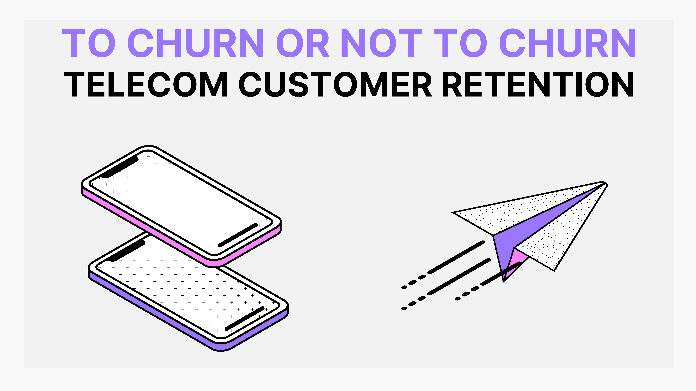
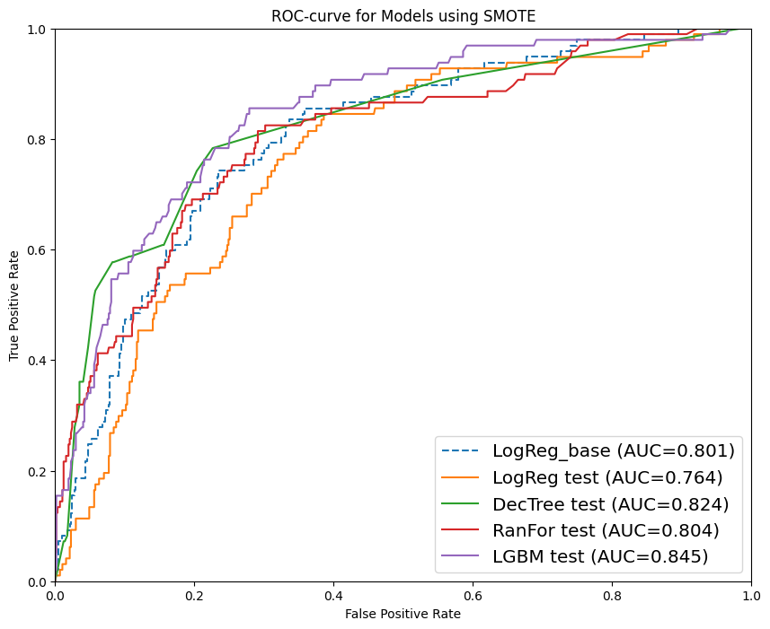
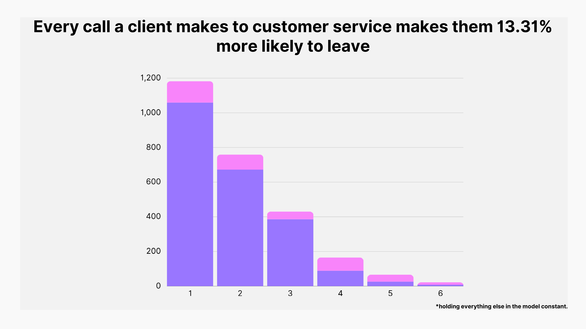
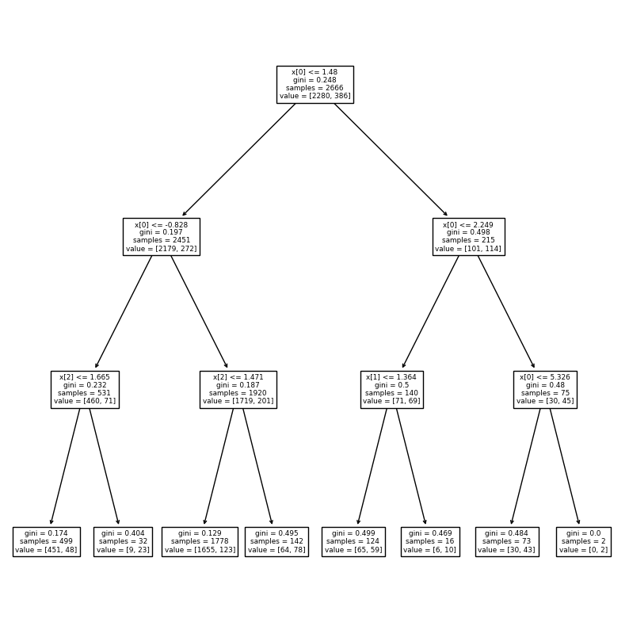

    

# Machine Learning Classification: Telecom Customer Retention

**Authors**: 
[Andrei Hushcha](mailto:andrew.hushcha@gmail.com), [Marley Lopez](mailto:Marleylopez@icloud.com)

## Overview
This project examines the patterns in churn, and strategies to curb churn, for a telecomunication company.  
Three features such as if clients have an international plan, how many minutes they talk on the phone during the day, and how many calls they make to customer service, account for 60% churn. The importance of these features is explored in a decision tree and individual logistic regressions.  
LightGBM is the best tool for predicting customer behavior with high accuracy and F1 scores.
The recommendations, such as to support customer service representatives; further research into qualms with the international plan were given as a result of the research.

## Business Understanding
Our client is a telecommunications company hoping to improve client retention.  
The business problem is to predict patterns in churn, and recommend strategies to curb churn.  
Keeping customer is crucial in this industry.

## Data Understanding
Our data source is the SyriaTel customer churn dataset. The dataset includes 20 features related to customer subscriptions to the company, such as account length, number of calls at various times, the assosciated charges to their account for those calls, and the number of calls made to customer service lines in regard to their subscription.  

Some limitations are related to lack of information on account dates, beyond length, and the dataset last being updated 6 years ago. While most features were normally distributed, 'churn', the target, had an imbalanced class we needed to corrrect.

## Methods
This project uses Logistic Regressions, Decision Trees, Light GBM, and RandomForest Models.  
Findings are informed by a strong understanding of NumPy, Pandas, Scikit Learn, and statistical analysis.

## Results

LightGBM is the best tool for predicting customer behavior, especially with a fantastic F1 score.  
That is also proven by the best ROC-curve.

    

 
 
The important features that informed this model were if clients had an international plan, how many minutes they talked on the phone during the day, and how many calls they made to customer service.  
These three features accounted for 60% churn.
Each additional call to customer service makes a client 13% more likely to leave SyriaTel

    

 
 
The Decision Tree made it clear that all values are categorized 'churn' after the 5th call

    

## Conclusions
This analysis leads to the recommendations for our telecommunication company client to keep their customersc.

**Each additional call to customer service makes a client 13% more likely to leave SyriaTel, while Decision Tree made it clear that all values are categorized 'churn' after the 5th call:**  
Support customer service representatives so that they can best meet the needs of our clients

**Having the international plan makes customers 14.79% more likely to leave SyriaTel:**  
Further research into qualms with the international plan will allow us to better respond to customer needs

## Next Steps
Further analysis is essential in determining critical drivers and gaining valuable insights:

- **Datetime Information:** Adding DateTime information to accounts, so we can best track the relevancy of these issues

- **Pairing with NLP Model:** Pairing with an NLP model of online reviews would make it possible to see customer feedback, a weakness in the current dataframe.

## Appendix
The complete analysis can be found in the <a href="Modeling Churn.ipynb">Jupyter Notebook</a> and in our <a href="presentation.pdf">presentation</a>.

For general questions, please contact Andrei Hushcha at <a href="mailto:andrew.hushcha@gmail.com">andrew.hushcha@gmail</a>.
 
For technical questions, please contact Marley Lopez at <a href="mailto:Marleylopez@icloud.com.com">Marleylopez@icloud.com</a>.

## Sources

<a href="https://www.kaggle.com/datasets/becksddf/churn-in-telecoms-dataset/">The Dataset </a>

## Repository Structure

├── images
 
├── .gitignore
 
├── Modeling Churn.ipynb
 
├── README.md
 
├── churn.scv
 
└── presentation.pdf

